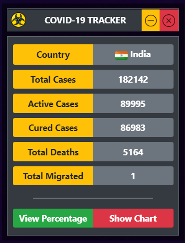
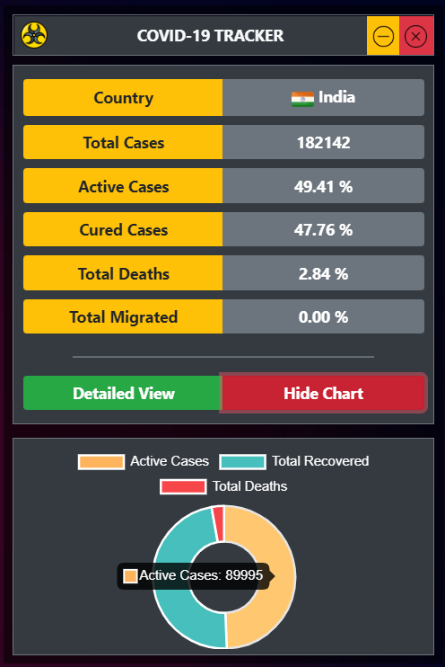
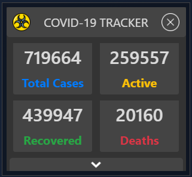

# COVID-19 Tracker Widget
A simple widget to track Corona Virus (COVID19) spread across India.

## Tech Stack
* ElectronJS
* NodeJS
* Bootstrap 4
* Library
  * JQuery
  * axios
  * cheerio
  * chart.js


## Screenshots
## Version 1
> Original UI
### Default View


### Expanded View


## Version 2
> Compact UI
### Default View


## Getting Started
#### Clone the repository.
#### Install NodeJS
#### Choose Version 1,2
#### Open terminal in version directory.
#### Install all the required modules
```
npm install
```
#### Execution
```
npm start
```
